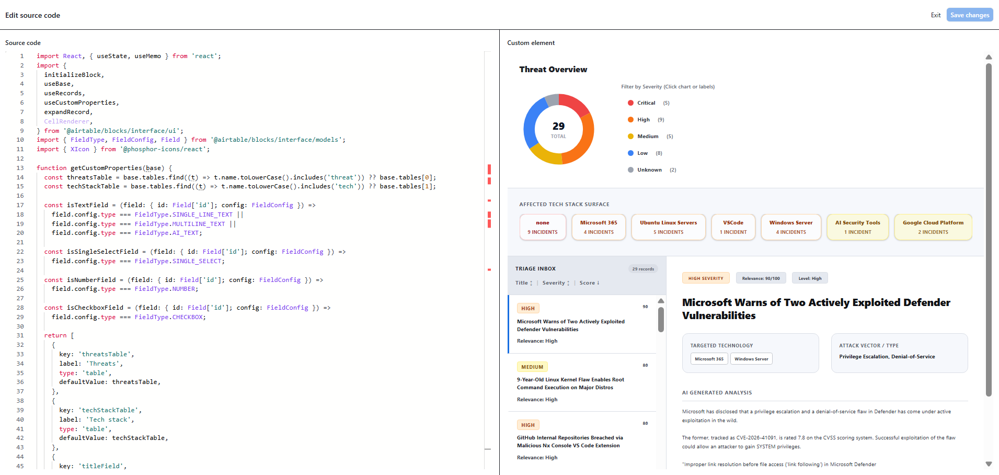
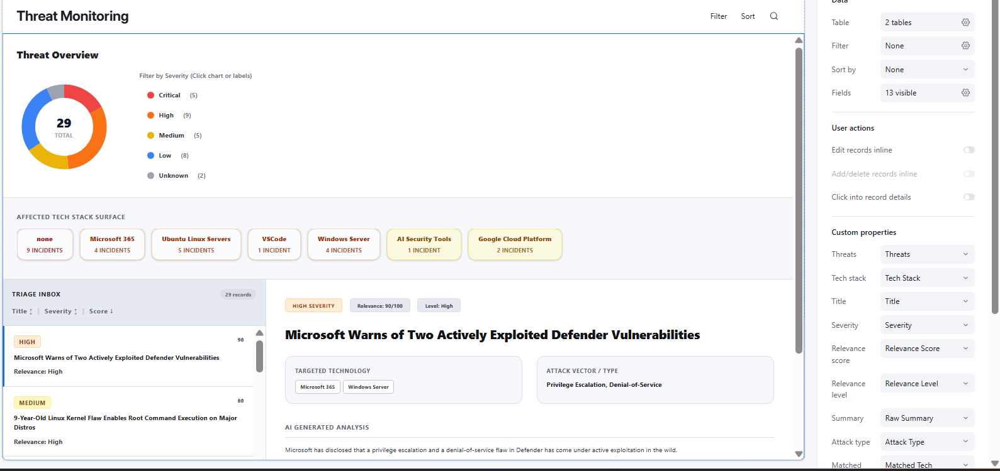
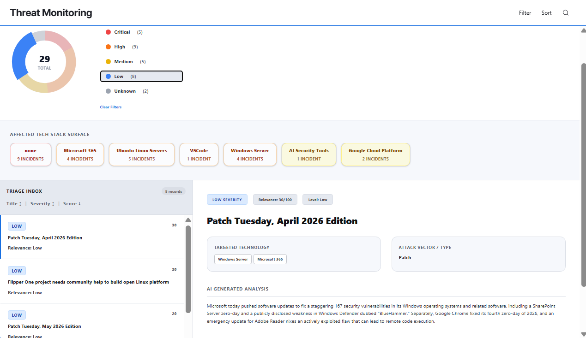

# Week 10: Dashboard Implementation & Prompt Log

**Name:** Safayet Safin  
**Role:** Component 4 Integration, Testing & Presentation  
**Project:** Threat Intelligence Feed Dashboard  
**Date:** 2026-05-24

## Part 1: Dashboard Views Implementation

To support the new Phase 4 error handling and confidence routing implemented by the team, I built out two specific, filtered views in our Airtable component.

### View 1: Active Threat Pipeline
This is the primary interface for our security analysts, explicitly filtered to display only fully processed records that meet our threshold for High or Critical severity.

### View 2: Error Monitoring & Manual Triage
This secondary diagnostic view catches all pipeline edge cases, specifically filtering for records where an API timeout occurred (status equals "error") or where the AI returned low confidence/missing IOCs.

